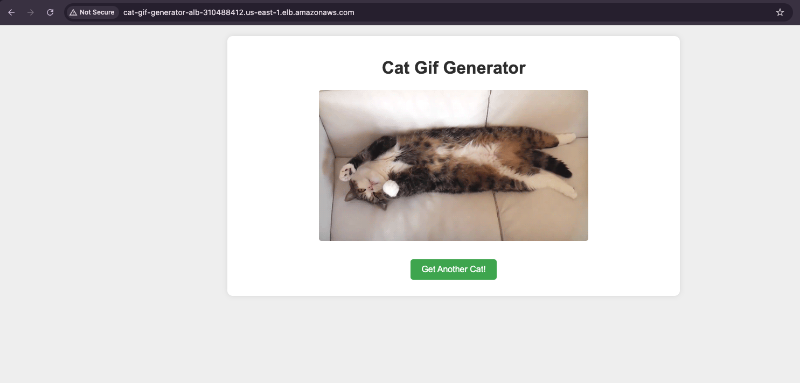

# cpe
This repo builds a simple cat gif generator that runs on AWS in ECS.
* The Cat gif generator is written in Fastapi and is using thecatapi.com
* Terraform is used to build the infrastructure.
* GHA are used to build the infrastructure and deploy code to AWS.

## Final Result.

